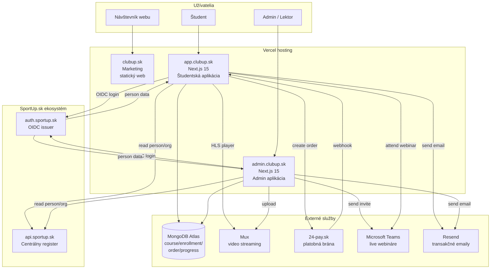
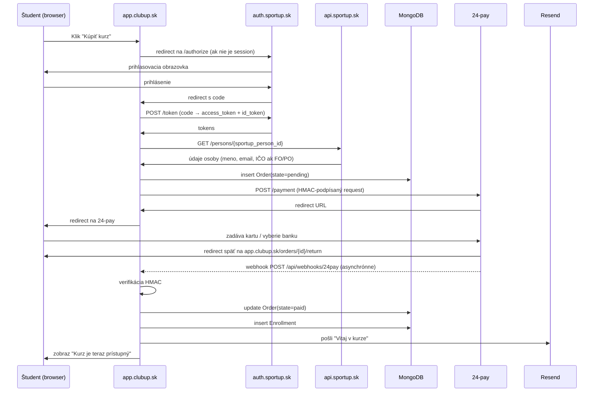

# High-level architektúra

## Celkový pohľad



## Tok dát: kúpa kurzu

Príklad „happy path" toku, keď študent kúpi kurz:



Detaily HMAC podpisu a webhook handlera v [`../payments/integration.md`](../payments/integration.md).

## Vrstvy

```
┌──────────────────────────────────────────────────────┐
│  UI Layer (apps/app, apps/admin)                     │
│  Server Components + Client Components               │
│  Forms, lists, players, dashboards                   │
└──────────────────────────────────────────────────────┘
                          ▲
                          │ Server Actions / Route Handlers
                          ▼
┌──────────────────────────────────────────────────────┐
│  Application Services                                │
│  enrollment-service, payment-service,                │
│  certificate-service, progress-service               │
└──────────────────────────────────────────────────────┘
              ▲                ▲                  ▲
              │                │                  │
              ▼                ▼                  ▼
┌──────────────────┐  ┌──────────────────┐  ┌──────────────────┐
│  packages/db     │  │  packages/auth   │  │  External APIs   │
│  Mongo + Zod     │  │  OIDC client     │  │  24-pay, Mux,    │
│  repositories    │  │  + RBAC helpers  │  │  Teams, Resend,  │
│                  │  │                  │  │  SportUp Registry│
└──────────────────┘  └──────────────────┘  └──────────────────┘
              ▲
              │
              ▼
       ┌──────────────┐
       │ MongoDB Atlas│
       └──────────────┘
```

## Multi-tenancy

ClubUp **nie je multi-tenant** v zmysle „každá organizácia má svoj subdomain a izolované dáta". Všetky dáta sú v jednej databáze. Organizácia (klub, zväz) sa objavuje ako:

- **Sponzor enrollmentu** — keď klub kúpi kurz pre 5 svojich ľudí (`Order.org_sponsor_id`)
- **Príjemca faktúry** — fakturujeme na klub, nie na študenta
- **Štatistický rez** — admin vie vidieť „Koľko ľudí z klubu Spartak má kurz dokončený"

Toto stačí pre Fázy 1–4. Ak by sme niekedy potrebovali izolované dáta (napr. súkromný kurz pre konkrétny zväz s vlastným obsahom), riešili by sme to cez `tenant_id` na úrovni `Course` a filter v repository vrstve. Zatiaľ to nepotrebujeme.

## Idempotencia

Všetky mutácie, ktoré závisia od externých služieb (24-pay webhook, Mux upload callback), sú idempotentné cez `idempotency_key` v MongoDB s unique indexom. Detaily v [`../payments/integration.md`](../payments/integration.md).

## Observability

- **Logy:** Vercel Logs (každý request, výstup `console.*`)
- **Errors:** Sentry (napojené v `instrumentation.ts`)
- **Performance:** Vercel Analytics + Speed Insights
- **Custom metrics:** počet enrollmentov, dokončených kurzov, prerušených platieb — vlastný dashboard v admin aplikácii
- **Audit trail:** `audit_logs` kolekcia v Mongo pre platby a admin akcie

Detaily v [`../operations/monitoring.md`](../operations/monitoring.md).
