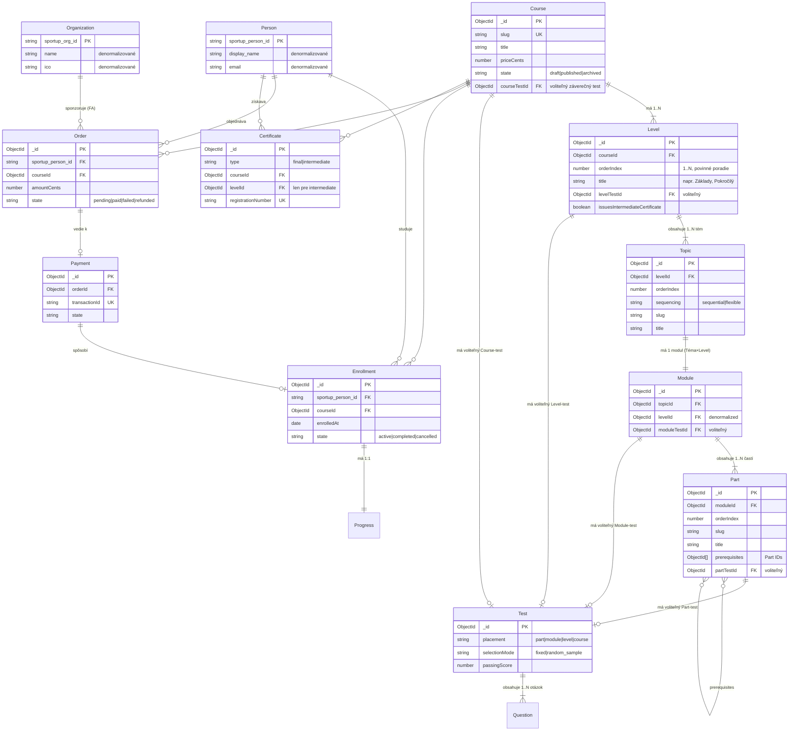
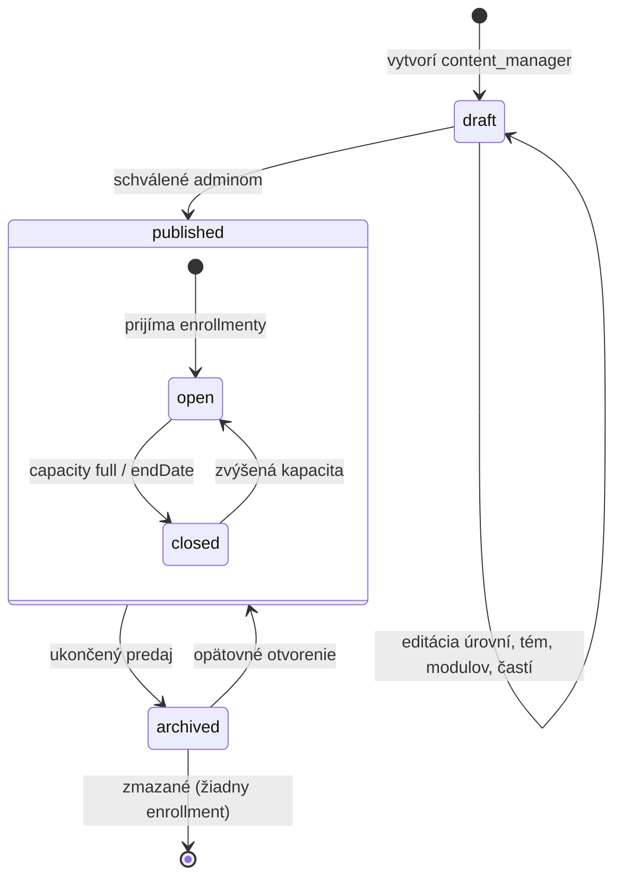
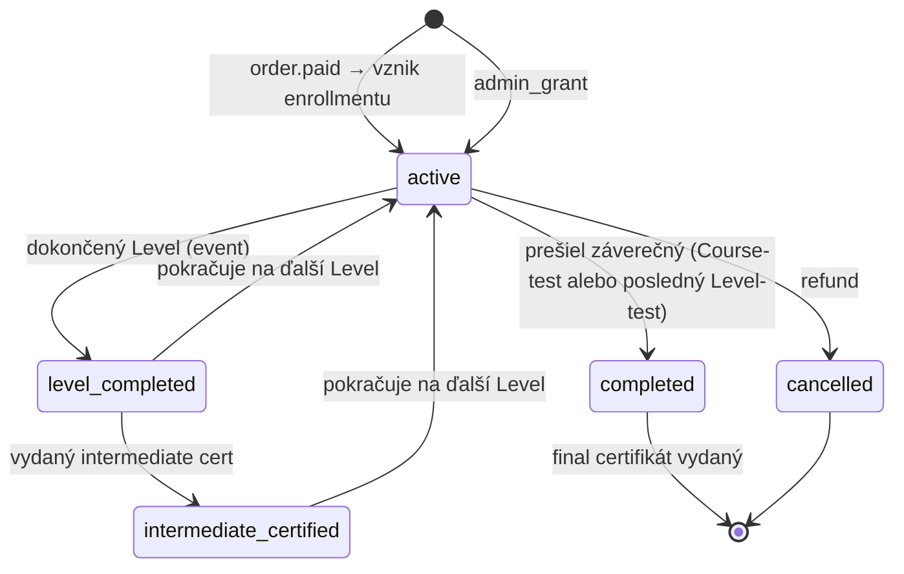
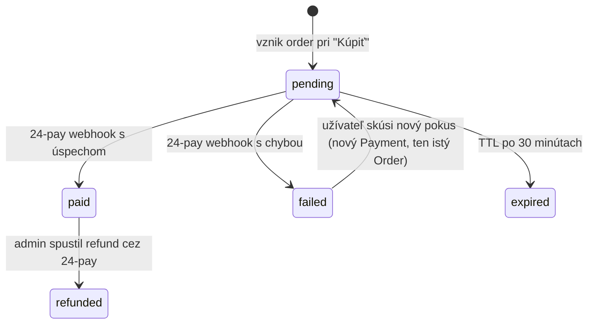

# Doménový model

> Doménové entity, vzťahy a životný cyklus.

## Hierarchia kurzu

ClubUp má **4-vrstvovú hierarchiu obsahu**:

```
Course (Kurz)
  └── Level (Úroveň)               ← povinná sekvencia: Level 1 → 2 → 3 → 4
       └── Topic (Téma)            ← N tém v rámci úrovne (flexibilné alebo sekvenčné)
            └── Module (Modul)     ← 1 Modul = 1 Téma × 1 Úroveň
                 └── Part (Časť)   ← 1+ častí (flexibilné alebo sekvenčné cez prerequisites)
                      └── Content + voliteľný Part-test
```

**Kľúčové pravidlá:**

- **Úrovne sú vždy sekvenčné**. Študent musí dokončiť všetky moduly v Úrovni 1 (a prejsť Level-test, ak je nastavený), kým dostane prístup do Úrovne 2.
- **Témy** v rámci úrovne môžu byť `sequential` (povinné poradie) alebo `flexible` (ľubovoľné poradie). Default: `flexible`. **Téma sama nemá test** — je to len organizačný prvok obsahu; hodnotenie ide cez Modul, ktorý je v jej vnútri.
- **Časti** v rámci modulu môžu mať definované `prerequisites[]` — povinné časti, ktoré musia byť dokončené pred touto časťou. Bez prerequisites = ľubovoľné poradie.
- **Hodnotenie** (testy) môže byť na 4 miestach:
  - **Časť** — voliteľný `Part-test` (overenie pochopenia konkrétnej časti)
  - **Modul** — voliteľný `Module-test` (záverečné overenie modulu)
  - **Úroveň** — voliteľný `Level-test` (medzicertifikát; admin sa rozhoduje, či vydáva intermediate Certificate)
  - **Course** — voliteľný `Course-test` (záverečný test celého kurzu pre `final` Certificate)
- **Final Certifikát** od ŽU sa vydáva po:
  - prejdení `Course-test` (ak je definovaný), ALEBO
  - dokončení posledného Levelu kurzu vrátane jeho `Level-test` (ak nie je definovaný `Course-test`)
- **Intermediate certifikáty** po Level-teste sú **voliteľné** — admin v `Level` entite nastavuje `issuesIntermediateCertificate: boolean`. Pri vyšších leveloch (Level 3, 4) je medzicertifikát zmysluplnejší než pri Level 1.

## Mapovanie kurzu „Športový manažment pre silnejšie kluby"

Kurz má **4 Úrovne × 10 Tém = 40 Modulov**:

| | Téma 1: Prostredie športu | Téma 2: Právne predpisy | … | Téma 10: Infraštruktúra |
|---|---|---|---|---|
| **Level 1: Základy** | Modul 1.1 | Modul 1.2 | … | Modul 1.10 |
| **Level 2: Pokročilý** | Modul 2.1 | Modul 2.2 | … | Modul 2.10 |
| **Level 3: Špecialista** | Modul 3.1 | Modul 3.2 | … | Modul 3.10 |
| **Level 4: Stratég** | Modul 4.1 | Modul 4.2 | … | Modul 4.10 |

Študent musí najprv dokončiť všetkých 10 modulov v Level 1, prejsť Level-test (ak je nastavený), potom prejsť do Level 2 atď. V rámci jedného Levelu sa 10 tém dá robiť v ľubovoľnom poradí (default `flexible`).

Kompletná osnova v [`../curriculum/sportovy-manazment.md`](../curriculum/sportovy-manazment.md).

## Entity

| Entita | Popis | Owner |
|---|---|---|
| [`Course`](course.md) | Kurz — najvyššia jednotka vzdelávania | ClubUp |
| [`Level`](level.md) | Úroveň v kurze (Level 1..N), povinná sekvencia | ClubUp |
| [`Topic`](topic.md) | Téma v rámci úrovne (organizačný kontajner, bez testu) | ClubUp |
| [`Module`](module.md) | Modul = priesečník (Téma × Úroveň) | ClubUp |
| [`Part`](part.md) | Časť modulu — najmenšia jednotka obsahu | ClubUp |
| [`Test` & `Question`](test.md) | Test (Časť/Modul/Úroveň/Course) a otázky | ClubUp |
| [`Webinar`](webinar.md) | Plánovaný live event v Teams | ClubUp |
| [`Enrollment`](enrollment.md) | Zápis osoby do kurzu | ClubUp |
| [`Progress`](progress.md) | Postup študenta | ClubUp |
| [`Order`](order.md) | Objednávka kurzu | ClubUp |
| [`Payment`](payment.md) | Platobná transakcia | 24-pay (zdroj pravdy) |
| [`Certificate`](certificate.md) | Záznam o vydanom certifikáte (final aj intermediate) | ClubUp + ŽU (PDF) |
| [`Person`](person.md) | Osoba (denormalizovaný snapshot) | **SportUp.sk** (autoritatívny zdroj) |
| [`Organization`](organization.md) | Organizácia (denormalizovaný snapshot) | **SportUp.sk** (autoritatívny zdroj) |

## Hlavný diagram



## Princípy modelovania

### 1. Téma je organizačný kontajner, nie evaluovaná entita

Téma (Topic) zoskupuje obsah do tematických celkov, ale **nemá vlastný test ani vlastný progress milestone**. Testovanie a hodnotenie ide cez Modul (ktorý je v jej vnútri) a Úroveň (ktorá ju obaľuje). Toto zjednodušuje progress tracking — študent nemusí premýšľať „dokončil som tému?", iba „dokončil som modul?".

### 2. Testy sú samostatná entita s `placement`

Test má pole `placement: 'part' | 'module' | 'level' | 'course'`, ktoré určuje, kde sa zobrazí a kedy sa vyhodnocuje. Toto je flexibilnejšie než embedované testy — vieme **zdieľať jeden test medzi viacerými miestami** (zriedkavé, ale možné napr. pre univerzálny záverečný test) a môžeme test versionovať nezávisle od entity, ku ktorej patrí.

### 3. Course-test je voliteľný

Ak kurz nemá `Course-test`, certifikát od ŽU sa vydá po dokončení posledného Levelu (vrátane jeho Level-testu, ak je definovaný). Ak `Course-test` existuje, je to záverečný test, ktorý určuje vydanie `final` certifikátu.

### 4. Intermediate certifikáty sú voliteľné per Level

Každý Level má `issuesIntermediateCertificate: boolean`. Pri Level 1 typicky `false` (po základoch nedávame ostrý certifikát), pri Level 3–4 môže byť `true` (špecialistický medzicertifikát).

### 5. Person & Organization sú denormalizované referencie

ClubUp **nezakladá** dokumenty pre `Person` a `Organization` v lokálnej DB. Drží len `sportup_person_id` / `sportup_org_id`. Pri zobrazení sa údaje:

- buď pri-fetchnú z `auth.sportup.sk` cez session JWT (pre vlastný profil)
- alebo z `api.sportup.sk` cez REST (pre admin pohľady na iných ľudí)
- alebo sa **denormalizujú do dokumentu** v okamihu vzniku (do `Order.studentDisplayName`), aby bolo možné rýchlo render-ovať bez extra fetch-u — s rizikom mierneho lagu pri zmene mena. Pre faktúry je to dokonca žiaduce (snapshot mena v čase platby).

### 6. Progress je 1:1 s Enrollment

Mohol by byť embedded v Enrollment, ale samostatný dokument umožňuje:

- **menšie write-ops** pri kliku „označ časť ako dokončenú" (nemusí sa loadovať celý enrollment)
- **agregácie** typu „koľko častí týždenne dokončia naši študenti" bez načítania enrollment metadát
- jednoduchý **pre-allocation** pri zápise (vytvoriť pole pre každú časť rovno)

### 7. Payment vs Order

`Order` je naša interná evidencia (čo si kto chcel kúpiť). `Payment` je metadáta o transakcii v 24-pay. Jeden Order môže mať viacero Payment-ov (napr. neúspešný pokus, potom úspešný). Order má `state`, ktorý odráža výsledok najnovšej platby.

### 8. Certificate je iba „odkaz na PDF u ŽU"

ClubUp negeneruje PDF certifikátu sám. Po dokončení kurzu (alebo Level-testu pre intermediate) zavoláme Žilinskú univerzitu (manuálne v Fáze 1, automatizovane neskôr) a zaregistrujeme certifikát. ŽU vráti `registrationNumber` a podpísané PDF.

## Životný cyklus kurzu



## Životný cyklus enrollmentu



## Životný cyklus objednávky



## Kompletné schémy

Detaily v jednotlivých súboroch:

- [`course.md`](course.md)
- [`level.md`](level.md)
- [`topic.md`](topic.md)
- [`module.md`](module.md)
- [`part.md`](part.md)
- [`test.md`](test.md)
- [`webinar.md`](webinar.md)
- [`enrollment.md`](enrollment.md)
- [`progress.md`](progress.md)
- [`order.md`](order.md)
- [`payment.md`](payment.md)
- [`certificate.md`](certificate.md)
- [`person.md`](person.md) — denormalizovaný snapshot zo SportUp
- [`organization.md`](organization.md) — denormalizovaný snapshot zo SportUp

## MongoDB collection naming

`courses`, `levels`, `topics`, `modules`, `parts`, `tests`, `questions`, `test_attempts`, `webinars`, `enrollments`, `progress`, `orders`, `payments`, `certificates`, `audit_logs`, `webhook_events`, `idempotency_keys`.

Žiadne podtržníky, plurál, kebab-case nepoužívame.

## Versioning entít

- `Course`, `Level`, `Topic`, `Module`, `Part`, `Test`, `Question` — **immutable po publikovaní**. Akákoľvek zmena vytvára novú verziu (`previousVersionId` pole na úrovni `Course`). Toto je dôležité, lebo už zapísaní študenti musia vidieť presne ten obsah, ktorý si kúpili.
- `Enrollment` ukladá `courseVersionId`, ktorý odkazuje na konkrétnu verziu kurzu v čase zápisu.
- Detaily v [`versioning.md`](versioning.md) (TBD).
