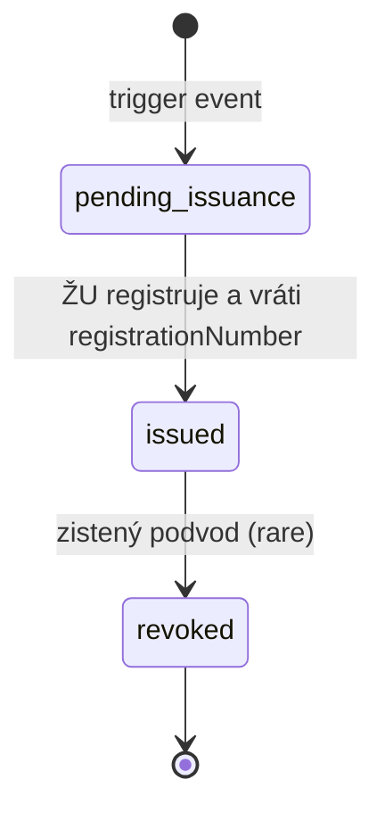

# Certificate

Záznam o vydaní certifikátu študentovi. Samotný certifikát ako PDF s podpisom **vydáva Žilinská univerzita** (FRI ŽU); ClubUp eviduje len metadata.

## Typy certifikátov

| Typ | Kedy sa vydáva | Účel |
|---|---|---|
| **`final`** | Po dokončení **celého kurzu** (všetky Levels + Course-test ak je definovaný) | Hlavný akreditovaný certifikát od ŽU — to, čo robí kurz hodnotným |
| **`intermediate`** | Po dokončení **konkrétneho Levelu** (ak `Level.issuesIntermediateCertificate: true`) | „Medzicertifikát" — voliteľné, typicky pri vyšších leveloch (Level 3, 4) |

V kurze „Športový manažment" je typický scenár:

- Level 1 (Základy) — bez intermediate cert
- Level 2 (Pokročilý) — bez intermediate cert
- Level 3 (Špecialista) — **s intermediate cert** („Špecialista v športovom manažmente")
- Level 4 (Stratég) — **s intermediate cert** + zároveň final cert (po Course-test alebo Level 4 test)

## Schéma

| Pole | Typ | Required | Popis |
|---|---|---|---|
| `_id` | ObjectId | ✓ | |
| `type` | enum | ✓ | `final` alebo `intermediate` |
| `studentId` | string | ✓ | `sportup_person_id` |
| `studentDisplayName` | string | ✓ | Snapshot v čase vydania |
| `studentBirthDate` | Date | – | Pre identifikáciu na certifikáte (snapshot zo SportUp) |
| `courseId` | ObjectId | ✓ | |
| `courseVersionId` | ObjectId | ✓ | |
| `courseTitle` | string | ✓ | Snapshot |
| `levelId` | ObjectId | – (final), ✓ (intermediate) | Pre `intermediate` — ku ktorému Levelu sa cert viaže |
| `levelTitle` | string | – (final), ✓ (intermediate) | Snapshot názvu Levelu |
| `enrollmentId` | ObjectId | ✓ | |
| `issuedAt` | Date | ✓ | |
| `issuedBy` | IssuedBy | ✓ | Akreditovaný poskytovateľ |
| `registrationNumber` | string | ✓ (unique) | Číslo certifikátu pridelené poskytovateľom |
| `verificationHash` | string | ✓ | SHA-256 hash kombinácie polí pre verejné overenie |
| `pdfUrl` | string | – | Link na PDF certifikátu (ak ho ŽU sprístupní) |
| `certificateTitle` | string | ✓ | Názov vytlačený na certifikáte (napr. „Osvedčenie — Špecialista v športovom manažmente") |
| `revokedAt` | Date | – | Ak bol certifikát zrušený (napr. plagiát, podvod pri teste) |
| `revokedReason` | string | – | |
| `createdAt` | Date | ✓ | |
| `updatedAt` | Date | ✓ | |

```ts
type IssuedBy = {
  partnerOrgId: string;            // sportup_org_id of ŽU
  partnerName: string;             // "Žilinská univerzita v Žiline, Fakulta riadenia a informatiky"
  certificateType: string;         // "Osvedčenie o absolvovaní vzdelávacieho programu" alebo "Potvrdenie o absolvovaní úrovne"
  accreditationNumber?: string;
  signatoryName?: string;          // meno štatutára/dekana, čo podpísal
  signatoryRole?: string;
};
```

## Indexy

```ts
db.certificates.createIndex({ registrationNumber: 1 }, { unique: true });
db.certificates.createIndex({ studentId: 1, issuedAt: -1 });
db.certificates.createIndex({ courseId: 1, type: 1 });
db.certificates.createIndex({ verificationHash: 1 });
db.certificates.createIndex({ enrollmentId: 1, type: 1, levelId: 1 });
```

> Pozn.: jeden enrollment môže mať **viacero certifikátov** — 1 final + N intermediate (po každom Leveli s `issuesIntermediateCertificate: true`). Preto `enrollmentId` nie je unique. Unique je `(enrollmentId, type, levelId)` — jeden študent dostane ten istý intermediate cert max raz.

## Životný cyklus



### Triggery vydania certifikátu

- **`final` certificate**:
  - Trigger: `Progress.courseCompleted` sa zmení na `true`
  - Spustí sa async job `issueFinalCertificate(enrollmentId)`
- **`intermediate` certificate**:
  - Trigger: `Progress.levelCompletions` dostane nový záznam pre Level, kde `Level.issuesIntermediateCertificate: true`
  - Spustí sa async job `issueIntermediateCertificate(enrollmentId, levelId)`

## Vydanie certifikátu — flow

### Fáza 1 — manuálny

1. **Trigger**: Server detekuje dokončenie podľa pravidiel v `progress.md`
2. **Validácia**: kontrola, že študent prešiel všetky predpisané kroky (re-validácia, aby sa zabránilo race conditions)
3. **Notifikácia adminovi**: email „John Doe dokončil kurz/Level X, pripravený na certifikát"
4. **Manuálny export**: admin v admin app klikne „Export pre ŽU" → CSV s detailmi (meno, dátum narodenia, kurz/level, dátum dokončenia, score)
5. **Komunikácia so ŽU**: admin pošle CSV študijnému oddeleniu FRI ŽU
6. **Spätná väzba**: ŽU vytvorí certifikát, pridelí `registrationNumber`, pošle PDF adminovi
7. **Záznam**: admin nahrá detaily do ClubUp (vznikne `Certificate` dokument)
8. **Notifikácia študenta**: email s odkazom na detail certifikátu a verejnú overovaciu URL

### Fáza 2 — poloautomatizovaný (po dohode so ŽU)

API integrácia s ŽU systémom:

1. ClubUp automaticky volá ŽU API s dokončením kurzu/Levelu
2. ŽU API vráti `registrationNumber` a URL na PDF
3. ClubUp aktualizuje `Certificate` entity
4. Email študentovi automaticky

## Verejné overovanie

Endpoint `GET /verify/{registrationNumber}?h={verificationHash}` vráti (bez autentifikácie):

```json
{
  "registrationNumber": "ZU-FRI-2026-0042",
  "type": "final",
  "courseTitle": "Športový manažment pre silnejšie kluby",
  "levelTitle": null,
  "issuedAt": "2026-12-15",
  "issuedBy": "Žilinská univerzita v Žiline, FRI",
  "valid": true,
  "verificationHash": "8f3a..."
}
```

Endpoint vyžaduje aj druhý parameter `?h=verificationHash` ako loose anti-enumeration ochranu — bez správneho hashu vrátime 404, takže útočník nemôže náhodne enumerovať čísla certifikátov.

## Hash computation

```ts
const verificationHash = sha256(
  [
    registrationNumber,
    type,
    studentId,
    courseId,
    courseVersionId,
    levelId ?? '',
    issuedAt.toISOString(),
  ].join('|')
);
```

Toto je deterministické. Ak si niekto ukladá certifikát a chce ho overiť, hash sa dá prepočítať a porovnať s tým v DB. Útočník by musel poznať aspoň `studentId` (čo nie je verejné).

## Príklad — final certifikát

```json
{
  "_id": "ObjectId('...')",
  "type": "final",
  "studentId": "sportup_person_id_123",
  "studentDisplayName": "Mária Nováková",
  "studentBirthDate": "1985-04-12",
  "courseId": "ObjectId('66e1f8a0123456789abcdef0')",
  "courseVersionId": "ObjectId('66e1f8a0123456789abcdef0')",
  "courseTitle": "Športový manažment pre silnejšie kluby",
  "levelId": null,
  "levelTitle": null,
  "enrollmentId": "ObjectId('...')",
  "issuedAt": "2026-12-15T10:00:00Z",
  "issuedBy": {
    "partnerOrgId": "sportup_org_id_zu",
    "partnerName": "Žilinská univerzita v Žiline, Fakulta riadenia a informatiky",
    "certificateType": "Osvedčenie o absolvovaní vzdelávacieho programu",
    "accreditationNumber": "123/2026",
    "signatoryName": "Prof. Ing. Príklad Dekan, PhD.",
    "signatoryRole": "Dekan FRI ŽU"
  },
  "registrationNumber": "ZU-FRI-2026-0042",
  "verificationHash": "8f3a2b1c...",
  "pdfUrl": "https://cdn.fri.uniza.sk/certifikaty/ZU-FRI-2026-0042.pdf",
  "certificateTitle": "Osvedčenie — Športový manažment pre silnejšie kluby",
  "createdAt": "2026-12-15T10:00:00Z",
  "updatedAt": "2026-12-15T10:00:00Z"
}
```

## Príklad — intermediate certifikát (po Level 3)

```json
{
  "_id": "ObjectId('...')",
  "type": "intermediate",
  "studentId": "sportup_person_id_123",
  "studentDisplayName": "Mária Nováková",
  "studentBirthDate": "1985-04-12",
  "courseId": "ObjectId('66e1f8a0123456789abcdef0')",
  "courseVersionId": "ObjectId('66e1f8a0123456789abcdef0')",
  "courseTitle": "Športový manažment pre silnejšie kluby",
  "levelId": "ObjectId('level_3_specialista')",
  "levelTitle": "Špecialista",
  "enrollmentId": "ObjectId('...')",
  "issuedAt": "2026-11-10T10:00:00Z",
  "issuedBy": {
    "partnerOrgId": "sportup_org_id_zu",
    "partnerName": "Žilinská univerzita v Žiline, Fakulta riadenia a informatiky",
    "certificateType": "Potvrdenie o absolvovaní úrovne vzdelávania"
  },
  "registrationNumber": "ZU-FRI-INT-2026-0017",
  "verificationHash": "1a2b3c4d...",
  "certificateTitle": "Potvrdenie — Špecialista v športovom manažmente",
  "createdAt": "2026-11-10T10:00:00Z",
  "updatedAt": "2026-11-10T10:00:00Z"
}
```
