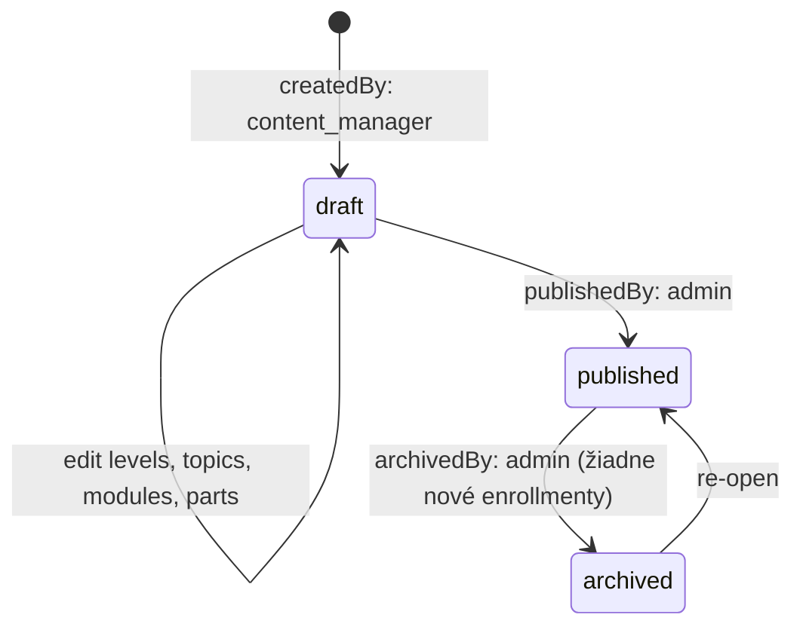

# Course (Kurz)

Kurz — najvyššia jednotka vzdelávania v ClubUp.

## Účel

`Course` reprezentuje konkrétny vzdelávací produkt, ktorý sa dá kúpiť, absolvovať a získať z neho **finálny certifikát** (od Žilinskej univerzity). Príklady:

- „Športový manažment pre silnejšie kluby" (prvý kurz, štart Fáza 1)
- Plánované ďalšie kurzy: „Marketing pre menšie kluby", „Financovanie športovej organizácie"

Kurz je usporiadaný do hierarchie:

```
Course
  └── Level (Úroveň, povinná sekvencia)
       └── Topic (Téma, organizačný kontajner bez testu)
            └── Module (Modul, hodnotiaca jednotka)
                 └── Part (Časť, jednotka obsahu)
```

## Schéma

| Pole | Typ | Required | Popis |
|---|---|---|---|
| `_id` | ObjectId | ✓ | Primárny kľúč |
| `slug` | string (unique) | ✓ | URL-friendly identifikátor (`sportovy-manazment`) |
| `title` | string | ✓ | Názov kurzu (zobrazovaný) |
| `subtitle` | string | – | Sekundárny názov / tagline |
| `description` | string (Markdown) | ✓ | Detailný popis pre marketing stránku kurzu |
| `shortDescription` | string | ✓ | 1–2 vety pre kartu v katalógu |
| `coverImageUrl` | string (URL) | – | Hlavný obrázok kurzu (na karte aj v hero kurzu) |
| `priceCents` | number (int) | ✓ | Cena v centoch (`12000` = 120,00 €) |
| `currency` | string | ✓ | ISO 4217, default `EUR` |
| `vatRate` | number | ✓ | DPH sadzba (`0.20` pre 20%) |
| `vatIncluded` | boolean | ✓ | Či je `priceCents` vrátane DPH |
| `targetAudience` | string[] | – | `executive_director`, `manager`, `founder`, `secretary` |
| `language` | string | ✓ | ISO 639-1 (`sk`) |
| `durationHours` | number | ✓ | Odhadovaný čas absolvovania celého kurzu (samoštúdium + webináre) |
| `levels` | ObjectId[] | ✓ | Referencie na `Level` v poradí (1..N, povinné poradie) |
| `courseTestId` | ObjectId | – | Voliteľný **záverečný test celého kurzu**. Ak je definovaný, určuje vydanie `final` certifikátu. |
| `courseTestRequired` | boolean | ✓ | `true` → kurz nie je dokončený bez prejdenia Course-testu. Default `true`, ak `courseTestId` existuje. |
| `instructors` | string[] | – | `sportup_person_id` lektorov |
| `instructorProfiles` | InstructorProfile[] | – | Snapshot mena, fota, bio v čase publikácie |
| `accreditation` | Accreditation | ✓ | Údaje o akreditovanom partnerovi (Žilinská univerzita) — povinné pre vydávanie `final` certifikátu |
| `state` | enum | ✓ | `draft`, `published`, `archived` |
| `version` | number | ✓ | Verzia (po publikovaní immutable, nová verzia = nový dokument) |
| `previousVersionId` | ObjectId | – | Odkaz na predošlú verziu, ak existuje |
| `publishedAt` | Date | – | Kedy bol publikovaný |
| `archivedAt` | Date | – | Kedy bol archivovaný |
| `enrollmentLimit` | number | – | Max. počet aktívnych enrollmentov (null = unlimited) |
| `enrollmentDeadline` | Date | – | Posledný možný dátum kúpy |
| `seoTitle` | string | – | `<title>` na verejnej stránke |
| `seoDescription` | string | – | `<meta description>` |
| `ogImageUrl` | string | – | OG image pre sociálne siete |
| `tags` | string[] | – | Pre vyhľadávanie a filtrovanie |
| `createdAt` | Date | ✓ | |
| `updatedAt` | Date | ✓ | |
| `createdBy` | string | ✓ | `sportup_person_id` autora draftu |
| `publishedBy` | string | – | `sportup_person_id` osoby, ktorá publikovala |

### Sub-typy

```ts
type InstructorProfile = {
  sportupPersonId: string;
  displayName: string;
  title?: string;          // "PhD.", "Mgr."
  bio?: string;            // krátky bio (Markdown)
  avatarUrl?: string;
  affiliation?: string;    // "FRI ŽU"
};

type Accreditation = {
  partnerOrgId: string;        // sportup_org_id of ŽU
  partnerName: string;         // "Žilinská univerzita v Žiline, FRI"
  certificateType: string;     // "Osvedčenie o absolvovaní vzdelávacieho programu"
  accreditationNumber?: string; // číslo akreditácie u MŠVVaŠ SR
};
```

## Indexy

```ts
db.courses.createIndex({ slug: 1 }, { unique: true });
db.courses.createIndex({ state: 1, publishedAt: -1 });
db.courses.createIndex({ tags: 1 });
db.courses.createIndex({ 'instructorProfiles.sportupPersonId': 1 });
```

## Životný cyklus



### Pravidlá

- **`draft` → `published`** je možné iba ak:
  - kurz má aspoň 1 Level
  - každý Level má aspoň 1 Topic
  - každá Topic má presne 1 Module
  - každý Module má aspoň 1 Part
  - aspoň jedna Part v každom Module je `requiredForCompletion: true`
  - cena je nastavená
  - `accreditation` je vyplnený
  - ak `courseTestId` existuje, je validný (placement = 'course')
- **`published` → `archived`** je možné kedykoľvek; existujúce enrollmenty pokračujú normálne, len sa kurz nedá kupovať
- **`archived` → `published`** je možné, pokiaľ ešte neuplynula `enrollmentDeadline`
- **Mazanie** — kurz sa nedá zmazať, ak má aspoň jeden enrollment. Iba archivovať. Toto je kvôli auditu a finančným záznamom.

### Versioning

Po publikovaní je dokument `Course` (a všetky jeho `Level`, `Topic`, `Module`, `Part`, `Test`) **immutable** v zmysle UI editácie. Ak content_manager chce zmeniť obsah:

1. Vytvorí novú verziu cez „Vytvoriť novú verziu" → vznikne nový `Course` dokument s `version: previous.version + 1`, `previousVersionId: previous._id`, `state: 'draft'`
2. Pri vzniku novej verzie sa **klonujú aj všetky pod-entity** (Levels, Topics, Modules, Parts, Tests) s novými `_id`, ale s rovnakou štruktúrou — content_manager ich potom môže upravovať
3. Editácia, publikácia
4. Stará verzia ostáva pre už zapísaných študentov (`Enrollment.courseVersionId`)
5. Nové enrollmenty idú do novej verzie

Dôvod: študent kúpil konkrétny obsah, musí ho dostať. Aj kvôli akreditácii — Žilinská univerzita certifikuje konkrétnu verziu kurzu.

## Dokončenie kurzu (final certifikát)

Kurz je `completed`, keď:

1. Všetky Levels sú `completed` (každý Level má dokončené všetky moduly + Level-test, ak je required), **A**
2. Ak `courseTestId` existuje a `courseTestRequired: true`, študent prešiel Course-test

Po `completed` sa spúšťa proces vydania `final` certifikátu (viď [`certificate.md`](certificate.md) — flow s Žilinskou univerzitou).

## Príklad dokumentu

```json
{
  "_id": "ObjectId('66e1f8a0123456789abcdef0')",
  "slug": "sportovy-manazment",
  "title": "Športový manažment pre silnejšie kluby",
  "subtitle": "Komplexné vzdelávanie pre výkonných riaditeľov",
  "shortDescription": "10 tém, 40 modulov, 4 úrovne — od základov po stratégiu.",
  "description": "## O kurze\n\nKomplexné vzdelávanie pre ľudí, ktorí riadia športové kluby...",
  "coverImageUrl": "https://cdn.clubup.sk/courses/sportovy-manazment/cover.webp",
  "priceCents": 49000,
  "currency": "EUR",
  "vatRate": 0.20,
  "vatIncluded": true,
  "targetAudience": ["executive_director", "founder", "secretary"],
  "language": "sk",
  "durationHours": 40,
  "levels": [
    "ObjectId('level_1_zaklady')",
    "ObjectId('level_2_pokrocily')",
    "ObjectId('level_3_specialista')",
    "ObjectId('level_4_strateg')"
  ],
  "courseTestId": null,
  "courseTestRequired": false,
  "instructors": ["sportup_person_id_1", "sportup_person_id_2"],
  "instructorProfiles": [
    {
      "sportupPersonId": "sportup_person_id_1",
      "displayName": "Doc. Ing. Ján Príklad, PhD.",
      "bio": "Pôsobí na Fakulte riadenia a informatiky ŽU...",
      "affiliation": "FRI ŽU"
    }
  ],
  "accreditation": {
    "partnerOrgId": "sportup_org_id_zu",
    "partnerName": "Žilinská univerzita v Žiline, Fakulta riadenia a informatiky",
    "certificateType": "Osvedčenie o absolvovaní vzdelávacieho programu",
    "accreditationNumber": "123/2026"
  },
  "state": "published",
  "version": 1,
  "publishedAt": "2026-09-01T08:00:00Z",
  "enrollmentLimit": null,
  "enrollmentDeadline": null,
  "seoTitle": "Športový manažment pre silnejšie kluby — ClubUp",
  "seoDescription": "Komplexné vzdelávanie pre výkonných riaditeľov...",
  "tags": ["manazment", "kluby", "akreditovany-kurz"],
  "createdAt": "2026-08-15T10:00:00Z",
  "updatedAt": "2026-09-01T08:00:00Z",
  "createdBy": "sportup_person_id_creator",
  "publishedBy": "sportup_person_id_admin"
}
```

> Pozn.: Tento kurz nemá `courseTestId` — finálny certifikát sa vydá po dokončení posledného Levelu (`level_4_strateg`) vrátane jeho `Level-testu`.

## API operácie

| Operácia | Endpoint | Roly |
|---|---|---|
| List published | `GET /api/courses` | public |
| Detail (slug) | `GET /api/courses/:slug` | public |
| Detail (admin, vrátane drafts) | `GET /api/admin/courses/:id` | content_manager+ |
| Create draft | `POST /api/admin/courses` | content_manager+ |
| Update draft | `PATCH /api/admin/courses/:id` | content_manager+ |
| Publish | `POST /api/admin/courses/:id/publish` | admin |
| Archive | `POST /api/admin/courses/:id/archive` | admin |
| Create new version | `POST /api/admin/courses/:id/new-version` | content_manager+ |

Detaily v [`../api/courses.md`](../api/courses.md).
