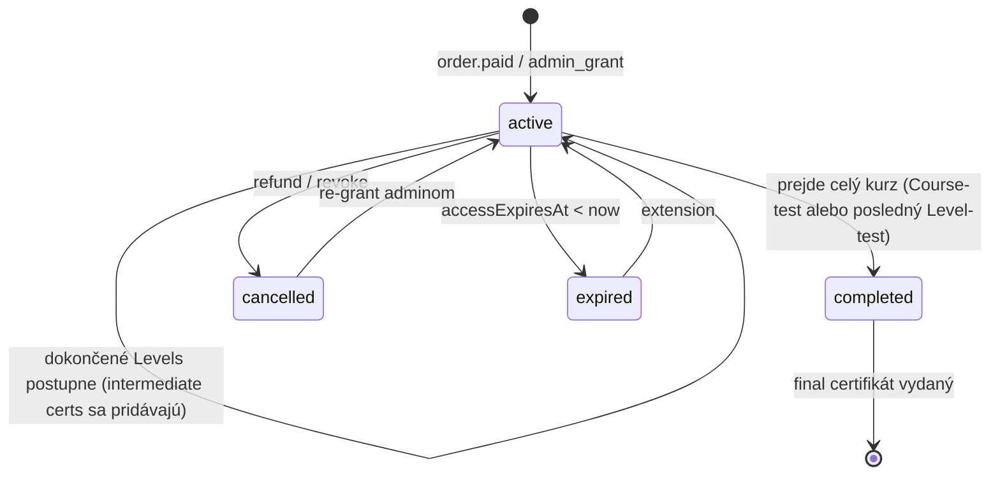

# Enrollment

Zápis konkrétnej osoby do konkrétneho kurzu. Vzniká po úspešnej platbe alebo manuálnym udelením prístupu adminom.

## Schéma

| Pole | Typ | Required | Popis |
|---|---|---|---|
| `_id` | ObjectId | ✓ | |
| `studentId` | string | ✓ | `sportup_person_id` |
| `studentDisplayName` | string | ✓ | Snapshot mena v čase zápisu (pre rýchly render) |
| `studentEmail` | string | ✓ | Snapshot emailu (pre notifikácie) |
| `courseId` | ObjectId | ✓ | |
| `courseVersionId` | ObjectId | ✓ | Konkrétna verzia kurzu, do ktorej je zapísaný |
| `courseTitle` | string | ✓ | Snapshot názvu kurzu |
| `enrolledAt` | Date | ✓ | |
| `state` | enum | ✓ | `active`, `completed`, `cancelled`, `expired` |
| `reason` | enum | ✓ | `paid`, `admin_grant`, `sponsor`, `migration` |
| `orderId` | ObjectId | – | Ak `reason=paid`, odkaz na objednávku |
| `sponsorOrgId` | string | – | Ak `reason=sponsor`, `sportup_org_id` klubu/zväzu |
| `grantedBy` | string | – | Ak `reason=admin_grant`, `sportup_person_id` admina |
| `grantReason` | string | – | Voľnotextové vysvetlenie pre audit |
| `accessExpiresAt` | Date | – | Voliteľné — ak má prístup časový limit |
| `completedAt` | Date | – | Kedy bol kurz dokončený (`state=completed`) |
| `cancelledAt` | Date | – | Kedy bol enrollment zrušený |
| `cancellationReason` | string | – | `refund`, `admin_revoke`, `expired` |
| `finalCertificateId` | ObjectId | – | Ak bol vydaný `final` certifikát |
| `intermediateCertificateIds` | ObjectId[] | – | Zoznam vydaných `intermediate` certifikátov (počas postupu cez Levels) |
| `createdAt` | Date | ✓ | |
| `updatedAt` | Date | ✓ | |

## Indexy

```ts
db.enrollments.createIndex({ studentId: 1, courseId: 1 }, { unique: true });
db.enrollments.createIndex({ studentId: 1, state: 1 });
db.enrollments.createIndex({ courseId: 1, state: 1 });
db.enrollments.createIndex({ accessExpiresAt: 1 }, { sparse: true });
db.enrollments.createIndex({ sponsorOrgId: 1 }, { sparse: true });
```

## Pravidlá

- **Unique constraint na `{studentId, courseId}`** — jedna osoba môže mať max 1 enrollment na 1 kurz. Refund a re-purchase reactivuje pôvodný enrollment, nevytvára nový.
- Pri `reason=paid` musí existovať `orderId` so `state=paid`.
- Pri `reason=sponsor` `sponsorOrgId` je organizácia, ktorá zaplatila — fakturujeme na ňu.
- Pri `reason=admin_grant` je nutný `grantReason` (audit).
- `accessExpiresAt` posunie enrollment do `state=expired` cez nightly cron.
- Po `state=completed` už nie je možné enrollment „nedokončiť" (mimo refundu).
- **Postup cez Levels** sa neprejavuje na `state` enrollmentu — ostáva `active` až kým nie je celý kurz dokončený. Detaily o postupe sú v `Progress.levelCompletions[]`.
- **Intermediate certifikáty** sa pripočítavajú do `intermediateCertificateIds[]` postupne počas trvania enrollmentu.

## Životný cyklus



## Príklad — aktívny enrollment uprostred kurzu

```json
{
  "_id": "ObjectId('enrollment_1')",
  "studentId": "sportup_person_id_123",
  "studentDisplayName": "Mária Nováková",
  "studentEmail": "maria.novakova@klubsparta.sk",
  "courseId": "ObjectId('66e1f8a0123456789abcdef0')",
  "courseVersionId": "ObjectId('66e1f8a0123456789abcdef0')",
  "courseTitle": "Športový manažment pre silnejšie kluby",
  "enrolledAt": "2026-09-15T14:23:00Z",
  "state": "active",
  "reason": "paid",
  "orderId": "ObjectId('order_1')",
  "intermediateCertificateIds": [],
  "createdAt": "2026-09-15T14:23:00Z",
  "updatedAt": "2026-09-15T14:23:00Z"
}
```

## Príklad — dokončený enrollment s intermediate certifikátmi

```json
{
  "_id": "ObjectId('enrollment_2')",
  "studentId": "sportup_person_id_456",
  "studentDisplayName": "Peter Strategista",
  "studentEmail": "peter@klub.sk",
  "courseId": "ObjectId('66e1f8a0123456789abcdef0')",
  "courseVersionId": "ObjectId('66e1f8a0123456789abcdef0')",
  "courseTitle": "Športový manažment pre silnejšie kluby",
  "enrolledAt": "2026-03-01T10:00:00Z",
  "state": "completed",
  "reason": "paid",
  "orderId": "ObjectId('order_2')",
  "completedAt": "2026-12-15T15:30:00Z",
  "finalCertificateId": "ObjectId('cert_final_2')",
  "intermediateCertificateIds": [
    "ObjectId('cert_int_l3_2')",
    "ObjectId('cert_int_l4_2')"
  ],
  "createdAt": "2026-03-01T10:00:00Z",
  "updatedAt": "2026-12-15T15:30:00Z"
}
```

> Tento študent dostal 2 intermediate certifikáty (po Level 3 a Level 4) plus 1 final certifikát po dokončení celého kurzu.
