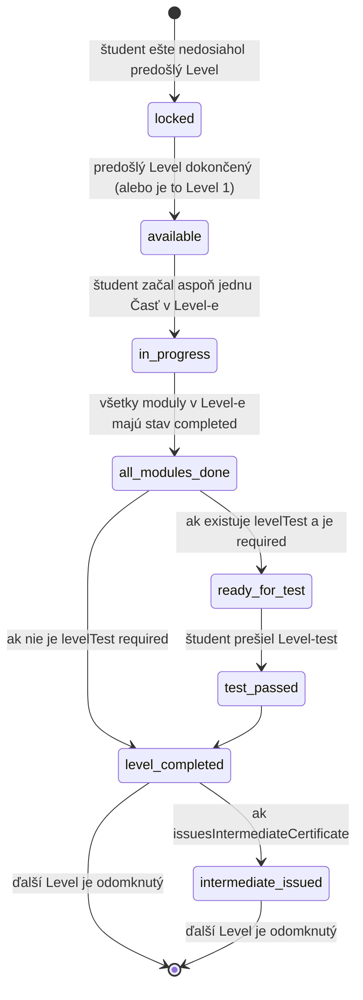

# Level (Úroveň)

Úroveň v kurze. Levely sú **vždy sekvenčné** — študent musí dokončiť Level N, kým získa prístup do Level N+1.

## Účel

`Level` reprezentuje stupeň náročnosti v kurze. Príklady (kurz „Športový manažment"):

- Level 1 — **Základy**
- Level 2 — **Pokročilý**
- Level 3 — **Špecialista**
- Level 4 — **Stratég**

Level obsahuje **jednu alebo viac Tém** (`Topic`), v ktorých sa nachádzajú **Moduly**.

## Schéma

| Pole | Typ | Required | Popis |
|---|---|---|---|
| `_id` | ObjectId | ✓ | |
| `courseId` | ObjectId | ✓ | Parent kurz |
| `orderIndex` | number | ✓ | 1-based pozícia v kurze (Level 1, Level 2, …). Unique v rámci kurzu. |
| `slug` | string | ✓ | URL-friendly (`zaklady`, `pokrocily`). Unique v rámci kurzu. |
| `title` | string | ✓ | Názov úrovne (napr. „Základy") |
| `subtitle` | string | – | Tagline („Pre začiatočníkov v športovom manažmente") |
| `description` | string (Markdown) | – | Detailný popis úrovne |
| `topics` | ObjectId[] | ✓ | Témy v poradí (poradie sa použije, ak `topicSequencing` je `sequential`) |
| `topicSequencing` | enum | ✓ | `sequential` (povinné poradie) alebo `flexible` (default — ľubovoľné poradie) |
| `levelTestId` | ObjectId | – | Voliteľný `Level-test` (ak je nastavený, je povinný pre dokončenie levelu) |
| `levelTestRequired` | boolean | ✓ | `true` → bez prejdenia Level-testu nie je level dokončený. Default `true`, ak `levelTestId` existuje. |
| `issuesIntermediateCertificate` | boolean | ✓ | `true` → po prejdení Level-testu sa vydá `intermediate` Certificate (medzicertifikát od ŽU). Default `false`. |
| `intermediateCertificateConfig` | object | – | Detaily pre intermediate cert (názov, signatár). Vyžadované ak `issuesIntermediateCertificate: true`. |
| `estimatedHours` | number | – | Odhadovaný čas absolvovania levelu (suma z modulov + buffer) |
| `createdAt` | Date | ✓ | |
| `updatedAt` | Date | ✓ | |

### Sub-typy

```ts
type IntermediateCertificateConfig = {
  certificateTitle: string;          // napr. "Osvedčenie — Základy športového manažmentu"
  partnerOrgId: string;              // sportup_org_id of ŽU (pre intermediate)
  partnerName: string;               // "Žilinská univerzita v Žiline, FRI"
  certificateType: string;           // "Potvrdenie o absolvovaní úrovne vzdelávania"
  signatoryName?: string;
  signatoryRole?: string;
};
```

## Indexy

```ts
db.levels.createIndex({ courseId: 1, orderIndex: 1 }, { unique: true });
db.levels.createIndex({ courseId: 1, slug: 1 }, { unique: true });
```

## Pravidlá

- **Sekvenčný postup**: študent musí dokončiť všetky moduly v Level N (a Level-test, ak je `levelTestRequired: true`) pred získaním prístupu do Level N+1.
- **Minimálne 1 Topic per Level**.
- **Validácia pri publish**: `levelTestId` musí byť `placement: 'level'` test, ktorý nepatrí inému Levelu.
- **Validácia issuesIntermediateCertificate**: ak `true`, musí existovať `levelTestId` (medzicertifikát bez testu nedáva zmysel) a vyplnený `intermediateCertificateConfig`.

## Postup študenta cez Level



## Príklad — Level 1 v kurze „Športový manažment"

```json
{
  "_id": "ObjectId('...')",
  "courseId": "ObjectId('66e1f8a0123456789abcdef0')",
  "orderIndex": 1,
  "slug": "zaklady",
  "title": "Základy",
  "subtitle": "Pre tých, ktorí začínajú s riadením klubu",
  "description": "## Čo sa naučíš\n\nÚvod do prostredia slovenského športu...",
  "topics": [
    "ObjectId('topic_1_1')",
    "ObjectId('topic_1_2')",
    "...10 tém spolu..."
  ],
  "topicSequencing": "flexible",
  "levelTestId": "ObjectId('test_level_1')",
  "levelTestRequired": true,
  "issuesIntermediateCertificate": false,
  "estimatedHours": 7.5,
  "createdAt": "2026-08-15T10:00:00Z",
  "updatedAt": "2026-09-01T08:00:00Z"
}
```

## Príklad — Level 4 (Stratég) s medzicertifikátom

```json
{
  "_id": "ObjectId('...')",
  "courseId": "ObjectId('66e1f8a0123456789abcdef0')",
  "orderIndex": 4,
  "slug": "strateg",
  "title": "Stratég",
  "topics": ["...10 tém..."],
  "topicSequencing": "flexible",
  "levelTestId": "ObjectId('test_level_4')",
  "levelTestRequired": true,
  "issuesIntermediateCertificate": true,
  "intermediateCertificateConfig": {
    "certificateTitle": "Osvedčenie — Stratég v športovom manažmente",
    "partnerOrgId": "sportup_org_id_zu",
    "partnerName": "Žilinská univerzita v Žiline, Fakulta riadenia a informatiky",
    "certificateType": "Potvrdenie o absolvovaní úrovne vzdelávania",
    "signatoryName": "Prof. Ing. Príklad Dekan, PhD.",
    "signatoryRole": "Dekan FRI ŽU"
  },
  "estimatedHours": 15,
  "createdAt": "2026-08-15T10:00:00Z",
  "updatedAt": "2026-09-01T08:00:00Z"
}
```
