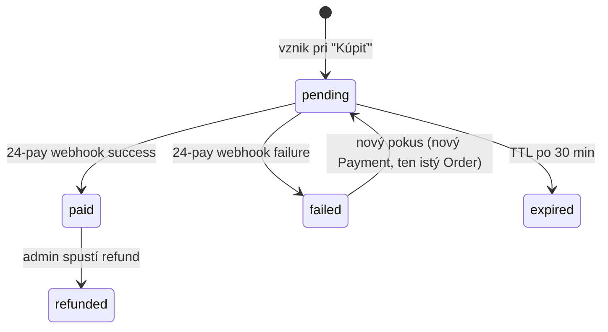

# Order

Objednávka kurzu. Vzniká pri kliku „Kúpiť kurz", ešte pred presmerovaním do platobnej brány.

## Schéma

| Pole | Typ | Required | Popis |
|---|---|---|---|
| `_id` | ObjectId | ✓ | |
| `orderNumber` | string | ✓ | Čitateľné poradové číslo (`CU-2026-000123`) — pre faktúru |
| `studentId` | string | ✓ | `sportup_person_id` |
| `studentDisplayName` | string | ✓ | Snapshot |
| `studentEmail` | string | ✓ | Snapshot |
| `billingType` | enum | ✓ | `individual` (FO) alebo `organization` (PO/ŽNS) |
| `billingDetails` | BillingDetails | ✓ | |
| `sponsorOrgId` | string | – | Ak klub kupuje pre svojho člena |
| `courseId` | ObjectId | ✓ | |
| `courseTitle` | string | ✓ | Snapshot |
| `courseSnapshot` | object | ✓ | Snapshot ceny a atribútov v čase objednávky |
| `amountCents` | number | ✓ | Cena v centoch |
| `currency` | string | ✓ | `EUR` |
| `vatRate` | number | ✓ | |
| `vatAmountCents` | number | ✓ | |
| `state` | enum | ✓ | `pending`, `paid`, `failed`, `expired`, `refunded` |
| `idempotencyKey` | string | ✓ | Unique pre prevenciu duplicitných objednávok |
| `paymentIds` | ObjectId[] | – | Odkazy na všetky pokusy `Payment` |
| `paidPaymentId` | ObjectId | – | Konkrétna úspešná platba |
| `enrollmentId` | ObjectId | – | Vytvorená po `state=paid` |
| `invoiceId` | string | – | Číslo faktúry (po vystavení) |
| `invoiceUrl` | string | – | Link na PDF faktúry |
| `expiresAt` | Date | ✓ | Po expirácii order ide do `expired` (default 30 min od vzniku) |
| `paidAt` | Date | – | |
| `refundedAt` | Date | – | |
| `refundReason` | string | – | |
| `createdAt` | Date | ✓ | |
| `updatedAt` | Date | ✓ | |

### `BillingDetails`

```ts
type BillingDetails =
  | {
      type: 'individual';
      firstName: string;
      lastName: string;
      email: string;
      phone?: string;
      address: Address;
    }
  | {
      type: 'organization';
      orgName: string;
      ico: string;          // IČO
      dic?: string;         // DIČ
      icDph?: string;       // IČ DPH (pre platcov)
      contactName: string;
      email: string;
      phone?: string;
      address: Address;
    };

type Address = {
  street: string;
  city: string;
  postalCode: string;
  country: string;          // ISO 3166-1 alpha-2 (default 'SK')
};
```

### `courseSnapshot`

Vždy ukladáme snapshot, lebo cena/popis sa môžu meniť, no faktúra musí odrážať stav v čase nákupu:

```ts
type CourseSnapshot = {
  courseId: ObjectId;
  versionId: ObjectId;
  title: string;
  priceCents: number;
  vatRate: number;
  vatIncluded: boolean;
  description: string;
};
```

## Indexy

```ts
db.orders.createIndex({ orderNumber: 1 }, { unique: true });
db.orders.createIndex({ idempotencyKey: 1 }, { unique: true });
db.orders.createIndex({ studentId: 1, createdAt: -1 });
db.orders.createIndex({ state: 1, expiresAt: 1 });
db.orders.createIndex({ courseId: 1 });
db.orders.createIndex({ sponsorOrgId: 1 }, { sparse: true });
```

## Životný cyklus



## Pravidlá

- **Idempotency**: ak sa frontend pokúsi zopakovať objednávku s rovnakým `idempotencyKey` (napr. dvojklik na „Kúpiť"), vráti sa existujúca objednávka.
- **Expiry**: `pending` orders s `expiresAt < now` sa cron-om presunú do `expired`. Pri ďalšom pokuse sa vytvorí nový Order.
- **Refund**: admin spustí refund cez Server Action; volá 24-pay refund API a pri úspechu mení state. Enrollment sa zruší (`cancelled`, `cancellationReason='refund'`).
- **Faktúra**: vystavuje sa automaticky pri `state=paid`. Pre Slovensko sú nutné polia: dodávateľ, odberateľ, IČO/DIČ, dátum dodania, splatnosť (=0 dní pri online platbe), položky s DPH.

## Príklad — individuálny zákazník

```json
{
  "_id": "ObjectId('...')",
  "orderNumber": "CU-2026-000123",
  "studentId": "sportup_person_id_123",
  "studentDisplayName": "Mária Nováková",
  "studentEmail": "maria.novakova@klubsparta.sk",
  "billingType": "individual",
  "billingDetails": {
    "type": "individual",
    "firstName": "Mária",
    "lastName": "Nováková",
    "email": "maria.novakova@klubsparta.sk",
    "address": {
      "street": "Hlavná 1",
      "city": "Žilina",
      "postalCode": "01001",
      "country": "SK"
    }
  },
  "courseId": "ObjectId('66e1f8a0123456789abcdef0')",
  "courseTitle": "Športový manažment pre silnejšie kluby",
  "courseSnapshot": {
    "courseId": "ObjectId('...')",
    "versionId": "ObjectId('...')",
    "title": "Športový manažment pre silnejšie kluby",
    "priceCents": 49000,
    "vatRate": 0.20,
    "vatIncluded": true,
    "description": "..."
  },
  "amountCents": 49000,
  "currency": "EUR",
  "vatRate": 0.20,
  "vatAmountCents": 8167,
  "state": "paid",
  "idempotencyKey": "9f3c2a1b...",
  "paymentIds": ["ObjectId('...')"],
  "paidPaymentId": "ObjectId('...')",
  "enrollmentId": "ObjectId('...')",
  "invoiceId": "FA2026000123",
  "invoiceUrl": "https://cdn.clubup.sk/invoices/FA2026000123.pdf",
  "expiresAt": "2026-09-15T14:53:00Z",
  "paidAt": "2026-09-15T14:25:00Z",
  "createdAt": "2026-09-15T14:23:00Z",
  "updatedAt": "2026-09-15T14:25:00Z"
}
```
