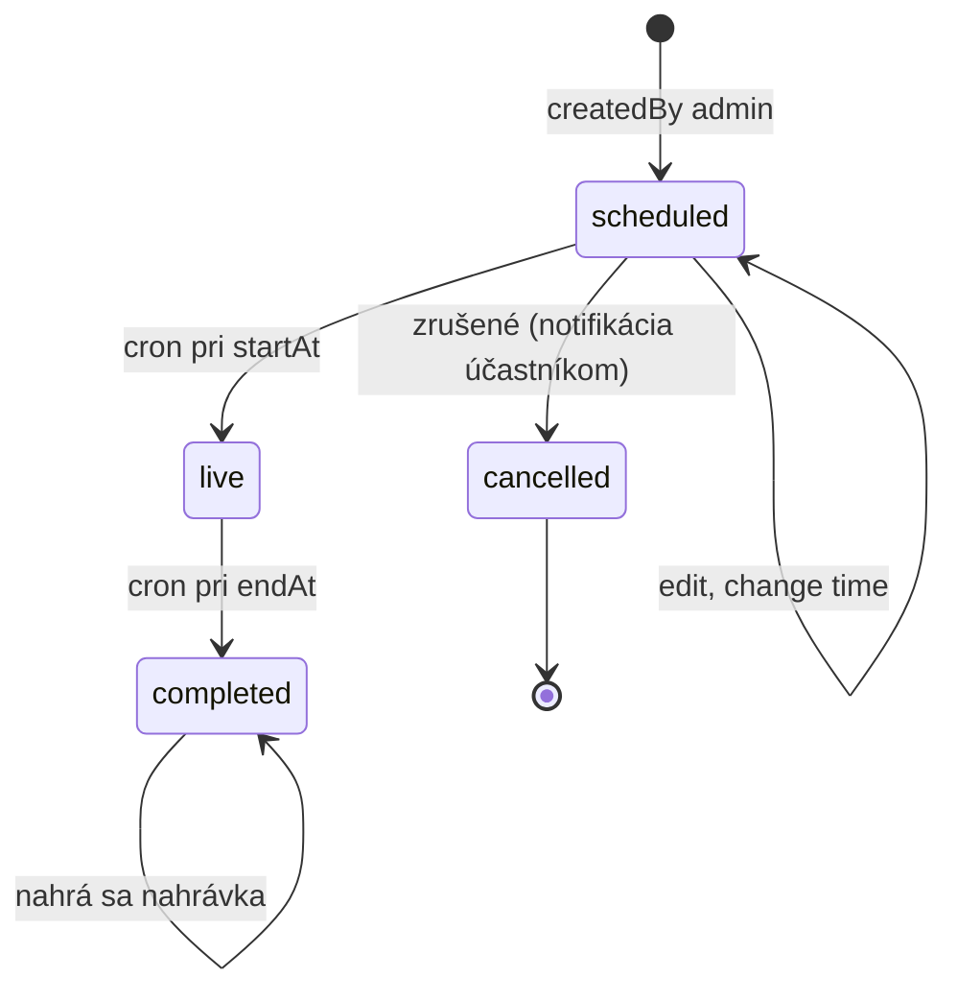

# Webinar

Plánovaný live event v Microsoft Teams. **Samostatná entita** — môže byť odkazovaný z jednej alebo viacerých Častí cez `WebinarBlock` v `Part.contentBlocks[]`.

## Schéma

| Pole | Typ | Required | Popis |
|---|---|---|---|
| `_id` | ObjectId | ✓ | |
| `courseId` | ObjectId | ✓ | Kurz, do ktorého patrí (denormalized) |
| `referencedFromPartIds` | ObjectId[] | – | Časti, ktoré tento webinár zobrazujú v `contentBlocks[]`. Pomocný field — vypočíta sa z DB pri update |
| `title` | string | ✓ | |
| `description` | string | – | Markdown — agenda, pre koho je vhodný, čo si priniesť |
| `startAt` | Date | ✓ | UTC timestamp |
| `endAt` | Date | ✓ | UTC timestamp |
| `timezone` | string | ✓ | IANA TZ (default `Europe/Bratislava`) |
| `instructor` | string | ✓ | `sportup_person_id` lektora |
| `coInstructors` | string[] | – | |
| `teamsJoinUrl` | string | – | Link na Teams meeting (generovaný cez MS Graph) |
| `teamsMeetingId` | string | – | ID v Microsoft Graph |
| `recordingPlaybackId` | string | – | Mux playback ID po nahratí (post-event) |
| `recordingDurationSec` | number | – | |
| `state` | enum | ✓ | `scheduled`, `live`, `completed`, `cancelled` |
| `attendanceLimit` | number | – | Max. počet účastníkov |
| `materials` | Attachment[] | – | Materiály k webinaru (slides, handout) |
| `qaThreadEnabled` | boolean | ✓ | Povoliť diskusiu pred/počas/po webinare? (default `true`) |
| `createdAt` | Date | ✓ | |
| `updatedAt` | Date | ✓ | |

## Indexy

```ts
db.webinars.createIndex({ startAt: 1 });
db.webinars.createIndex({ state: 1, startAt: 1 });
db.webinars.createIndex({ courseId: 1 });
db.webinars.createIndex({ instructor: 1 });
```

## Životný cyklus



## Účastníci

Vlastná pomocná entita `WebinarRSVP`:

| Pole | Typ | Popis |
|---|---|---|
| `_id` | ObjectId | |
| `webinarId` | ObjectId | |
| `enrollmentId` | ObjectId | |
| `studentId` | string | |
| `state` | enum | `going`, `maybe`, `not_going` |
| `respondedAt` | Date | |
| `attendedAt` | Date | timestamp príchodu (z Teams attendance reportu) |
| `attendanceMinutes` | number | trvanie pripojenia |

## Microsoft Teams integrácia

### Vytvorenie meetingu

1. Admin vytvorí Webinar v UI.
2. Server Action zavolá Microsoft Graph cez `packages/teams`:
   - `POST https://graph.microsoft.com/v1.0/users/{aplikacny-ucet}/onlineMeetings`
   - body: `{ subject, startDateTime, endDateTime, allowedPresenters: 'organizer', lobbyBypassSettings: { scope: 'organization', isDialInBypassEnabled: false } }`
3. Vrátený `joinUrl` uložíme ako `teamsJoinUrl`.

### Pozvánka pre študentov

- Po RSVP `going` pošleme email s **.ics prílohou** (vygenerovanou z `Webinar` dát) a `teamsJoinUrl`.
- Pripomienka 24 h pred + 1 h pred štartom.

### Záznam (recording)

- Teams nahráva automaticky (admin nastaví v meeting policy).
- Po skončení webinára Teams dá nahrávku do OneDrive/SharePoint.
- Manuálny krok (zatiaľ): admin stiahne z Teams, uploadne do Mux, vloží `recordingPlaybackId` do webinara.
- Automatizácia v neskoršej fáze cez Microsoft Graph webhooks + Mux upload API.

### Attendance report

- Po webinare cez Microsoft Graph `GET /me/onlineMeetings/{id}/attendanceReports` načítame zoznam účastníkov.
- Update `WebinarRSVP.attendedAt` a `attendanceMinutes`.
- Atendence sa zaráta do `Progress.partProgress[].blockProgress[]` (pre konkrétny `WebinarBlock`) ak `attendanceMinutes >= 0.5 * webinarDurationMin`.

## Príklad

```json
{
  "_id": "ObjectId('...')",
  "courseId": "ObjectId('course_sportovy_manazment')",
  "title": "Marketing klubu — Q&A s expertom",
  "description": "Pýtajte sa na konkrétne situácie z vášho klubu.",
  "startAt": "2026-11-15T18:00:00Z",
  "endAt": "2026-11-15T19:30:00Z",
  "timezone": "Europe/Bratislava",
  "instructor": "sportup_person_id_X",
  "teamsJoinUrl": "https://teams.microsoft.com/l/meetup-join/...",
  "teamsMeetingId": "MSPL_abc123",
  "state": "scheduled",
  "attendanceLimit": 200,
  "qaThreadEnabled": true,
  "createdAt": "2026-10-20T10:00:00Z",
  "updatedAt": "2026-10-20T10:00:00Z"
}
```

## Vzťah k Part

Webinar sa zobrazuje v Časti cez `WebinarBlock` v `Part.contentBlocks[]`:

```json
{
  "id": "block_5",
  "type": "webinar",
  "webinarId": "ObjectId('...')"
}
```

Jedna Časť môže obsahovať aj **viac webinárov v `contentBlocks[]`** (napr. 3 plánované live sessions ako súčasť jednej Časti). Webinar entity sú nezávislé — môžu existovať bez Part-u (napr. ad-hoc Q&A pre celý kurz, viazaný cez `courseId`).
